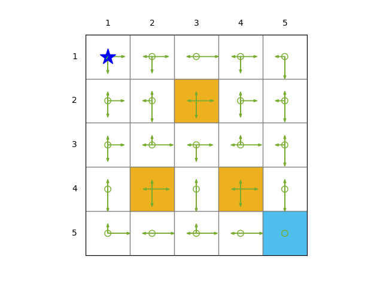

# Assignment 1 Report

**Course:** Reinforcement Learning  
**Student Number:** 20241203425

---

## 1. Software Description 

- **Programming Language:** Python 3.12
- **Libraries Used:** NumPy, Matplotlib, etc.
- **Custom Code:** RL_alg1.py, etc.

---

## 2. Reward Setting and Discount Rate

Describe the reward setting and discount rate used in the task.

- **Reward setting:**  
  - \( r_{\text{step}} = -1 \)  
  - \( r_{\text{forbidden}} = -5 \)  
  - \( r_{\text{target}} = 10 \)
  
- **Discount rate (\(\gamma\)):** 0.9

---

## 3. Policy Design

### 3.1 Deterministic Policy

#### 3.1.1 Policy Description (Table)
|    | down | right | up | left | stay |
|----|------|-------|----|------|------|
| s1 | 1    | 0     | 0  | 0    | 0    |
| s2 | 1    | 0     | 0  | 0    | 0    |
| s3 | 1    | 0     | 0  | 0    | 0    |
| s4 | 1    | 0     | 0  | 0    | 0    |
| s5 | 1    | 0     | 0  | 0    | 0    |
| s6 | 0    | 1     | 0  | 0    | 0    |
| s7 | 1    | 0     | 0  | 0    | 0    |
| s8 | 1    | 0     | 0  | 0    | 0    |
| s9 | 1    | 0     | 0  | 0    | 0    |
| s10 | 1    | 0     | 0  | 0    | 0    |
| s11 | 0    | 1     | 0  | 0    | 0    |
| s12 | 0    | 1     | 0  | 0    | 0    |
| s13 | 1    | 0     | 0  | 0    | 0    |
| s14 | 1    | 0     | 0  | 0    | 0    |
| s15 | 1    | 0     | 0  | 0    | 0    |
| s16 | 0    | 1     | 0  | 0    | 0    |
| s17 | 0    | 1     | 0  | 0    | 0    |
| s18 | 1    | 0     | 0  | 0    | 0    |
| s19 | 1    | 0     | 0  | 0    | 0    |
| s20 | 1    | 0     | 0  | 0    | 0    |
| s21 | 0    | 1     | 0  | 0    | 0    |
| s22 | 0    | 1     | 0  | 0    | 0    |
| s23 | 0    | 1     | 0  | 0    | 0    |
| s24 | 0    | 1     | 0  | 0    | 0    |
| s25 | 0    | 0     | 0  | 0    | 1    |

Each row represents the policy for a state, and each column represents the probability of taking the corresponding action.

#### 3.1.2 Policy Plot 


#### 3.1.3 Trajectory and Discounted Return (10%)

- **Starting State:** s1([1,1])
- **Trajectory Length:** 50 steps
- **Trajectory Plot:** 
- **Discounted Return:** 42.10 (caculated by the code)

---

### 3.2 Stochastic Policy

#### 3.2.1 Policy Description (Table)

|    | down | right | up   | left | stay |
|----|------|-------|------|------|------|
| s1 | 0.42 | 0.42  | 0.00 | 0.00 | 0.16 |
| s2 | 0.40 | 0.40  | 0.00 | 0.05 | 0.15 |
| s3 | 0.00 | 0.67  | 0.00 | 0.09 | 0.24 |
| s4 | 0.40 | 0.40  | 0.00 | 0.05 | 0.15 |
| s5 | 0.67 | 0.00  | 0.00 | 0.09 | 0.24 |
| s6 | 0.40 | 0.40  | 0.05 | 0.00 | 0.15 |
| s7 | 0.61 | 0.00  | 0.08 | 0.08 | 0.22 |
| s8 | 0.44 | 0.44  | 0.06 | 0.06 | 0.00 |
| s9 | 0.40 | 0.40  | 0.05 | 0.00 | 0.15 |
| s10| 0.61 | 0.00  | 0.08 | 0.08 | 0.22 |
| s11| 0.40 | 0.40  | 0.05 | 0.00 | 0.15 |
| s12| 0.00 | 0.61  | 0.08 | 0.08 | 0.22 |
| s13| 0.40 | 0.40  | 0.00 | 0.05 | 0.15 |
| s14| 0.00 | 0.61  | 0.08 | 0.08 | 0.22 |
| s15| 0.61 | 0.00  | 0.08 | 0.08 | 0.22 |
| s16| 0.67 | 0.00  | 0.09 | 0.00 | 0.24 |
| s17| 0.44 | 0.44  | 0.06 | 0.06 | 0.00 |
| s18| 0.67 | 0.00  | 0.09 | 0.00 | 0.24 |
| s19| 0.44 | 0.44  | 0.06 | 0.06 | 0.00 |
| s20| 0.67 | 0.00  | 0.09 | 0.00 | 0.24 |
| s21| 0.00 | 0.67  | 0.09 | 0.00 | 0.24 |
| s22| 0.00 | 0.67  | 0.00 | 0.09 | 0.24 |
| s23| 0.00 | 0.61  | 0.08 | 0.08 | 0.22 |
| s24| 0.00 | 0.67  | 0.00 | 0.09 | 0.24 |
| s25| 0.00 | 0.00  | 0.00 | 0.00 | 1.00 |

Each row represents the policy for a state, and each column represents the probability of taking the corresponding action.
#### 3.2.2 Policy Plot



#### 3.2.3 Trajectory and Discounted Return

- **Starting State:** s1([1,1])
- **Trajectory Length:** 50 steps
- **Trajectory Plot:** 
- **Discounted Return:** 27.84 (one example caculated by the code)

---

## 4. Policy Comparison 
Discuss your observations about the two policies. Focus on their performance, differences in the trajectories, and discounted returns.

---

## 5. Key Parts of the Code

Bash script to run the code:
```bash
# plot deterministic policy
python RL_alg1.py --exp_date "2024-09-14" --policy_type "deterministic" --plot_policy 1 --is_save_gif 0
# plot trajectory of deterministic policy
python RL_alg1.py --exp_date "2024-09-14" --policy_type "deterministic" --plot_policy 0 --is_save_gif 1

# plot stochastic policy
python RL_alg1.py --exp_date "2024-09-14" --policy_type "stochastic" --plot_policy 1 --is_save_gif 0
# plot trajectory of stochastic policy
python RL_alg1.py --exp_date "2024-09-14" --policy_type "stochastic" --plot_policy 0 --is_save_gif 1
```

Function to get the policy matrix for the deterministic policy:
```python
def get_policy_matrix_deterministic(env):
  '''
  get the policy matrix for the deterministic policy
  '''
    policy_matrix = np.zeros((env.num_states, len(env.action_space)))
    for state_index in range(env.num_states):
        x = state_index % env.env_size[0]
        y = state_index // env.env_size[0]

        if (x, y) == env.target_state:
            action_index = 4  # stay
        elif x==2 and y==3:
            action_index = 0
        else:
            delta_x = env.target_state[0] - x
            delta_y = env.target_state[1] - y

            if abs(delta_x) > abs(delta_y):
                if delta_x > 0:
                    action_index = 1  # right
                else:
                    action_index = 3  # left
            else:
                if delta_y > 0:
                    action_index = 0  # down
                else:
                    action_index = 2  # up

        policy_matrix[state_index, action_index] = 1

    return policy_matrix
```
Function to get the policy matrix for the stochastic policy:
```python
def get_policy_matrix_stochastic(env):
  '''
  get the policy matrix for the stochastic policy
  '''
    policy_matrix = np.zeros((env.num_states, len(env.action_space)))
    for state_index in range(env.num_states):
        x = state_index % env.env_size[0]
        y = state_index // env.env_size[0]

        if (x, y) == env.target_state:
            policy_matrix[state_index, 4] = 1  # stay
        else:
            distances = []
            for action_index in range(len(env.action_space)):
                action = env.action_space[action_index]
                dx, dy = action
                x_new = x + dx
                y_new = y + dy

                if (0 <= x_new < env.env_size[0] and
                    0 <= y_new < env.env_size[1] and
                    (x_new, y_new) not in env.forbidden_states):
                    distance = abs(x_new - env.target_state[0]) + abs(y_new - env.target_state[1])
                    distances.append(-distance)
                else:
                    distances.append(float('-inf'))

            exp_values = np.exp(distances)
            probabilities = exp_values / np.sum(exp_values)
            policy_matrix[state_index, :] = probabilities

    return policy_matrix

```
Function to  get the trajectory based on the policy matrix:
```python
def get_traj(args,policy_matrix):
  '''
  get the trajectory based on the policy matrix
  args: 
    args
    policy_matrix: policy matrix
  '''
    env = GridWorld(args)
    state = env.reset()  
    if args.policy_type == "deterministic":
        img_list = []
        return_dis = 0
        for t in range(args.length_simulation):
            # save the image list and draw .gif
            img = env.render()
            img_list.append(img)
            # import pdb; pdb.set_trace()
            # based on the policy matrix, select the action
            try:
                index_p = state[0][1] * env.env_size[0] + state[0][0]
            except:
                index_p = state[1] * env.env_size[0] + state[0]
            action = np.argmax(policy_matrix[index_p])
            action = env.action_space[action]
            next_state, reward, done, info = env.step(action)
            state = next_state
            print(f"Step: {t}, Action: {action}, State: {next_state+(np.array([1,1]))}, Reward: {reward}, Done: {done}")
            return_dis += reward*(args.gamma**t)
        if args.is_save_gif:
            imageio.mimsave(args.results_path+'/traj.gif', img_list, fps=5)
    elif args.policy_type == "stochastic":
        index = [0,1,2,3,4]
        img_list = []
        return_dis = 0
        for t in range(args.length_simulation):
            img = env.render()
            img_list.append(img)
            # based on the policy matrix, select the action
            try:
                index_p = state[0][1] * env.env_size[0] + state[0][0]
            except:
                index_p = state[1] * env.env_size[0] + state[0]
            action = np.random.choice(index, p=policy_matrix[index_p])
            action = env.action_space[action]
            next_state, reward, done, info = env.step(action)
            state = next_state
            return_dis += reward*(args.gamma**t)
            print(f"Step: {t}, Action: {action}, State: {next_state+(np.array([1,1]))}, Reward: {reward}, Done: {done}")
        if args.is_save_gif:
            imageio.mimsave(args.results_path+'/traj.gif', img_list, fps=5)
    print("The return of the traj is: ", return_dis)
    print("Simulation finished, results are saved in ", args.results_path)
        
```

More details can be found in the code files.

---

## 6. Conclusion

As a conclusion, the deterministic policy is more efficient than the stochastic policy in this task with **fixed environment**. The deterministic policy has a higher discounted return and reaches the target state faster than the stochastic policy. The deterministic policy has a higher probability of taking the optimal action at each state, while the stochastic policy has a lower probability of taking the optimal action at each state. The stochastic policy has a lower discounted return and takes more steps to reach the target state than the deterministic policy.

---