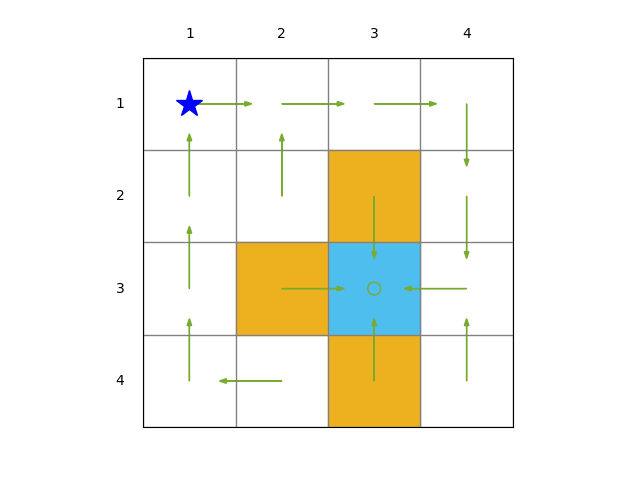
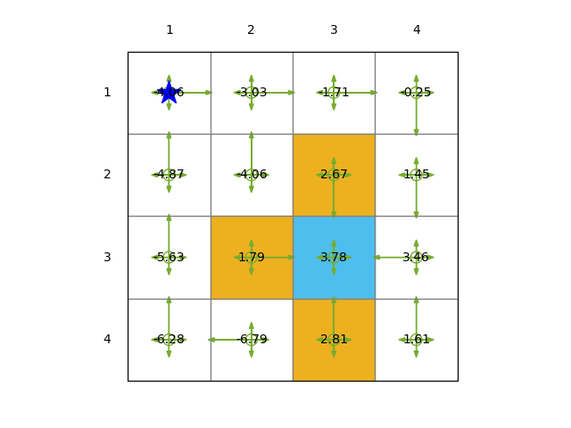

# Assignment 1 Report

**Course:** Reinforcement Learning  
**Student Number:** 20241203425

---

## 1. Software Description 

- **Programming Language:** Python 3.12
- **Libraries Used:** NumPy, Matplotlib, etc.
- **Custom Code:** RL_alg1.py, etc.

---

## 2. Problem setup

Describe the reward setting and discount rate used in the task.

- **Task:** 
•  1 target area, 3 forbidden areas
• 13 states, each of which has 5 actions
- **Reward setting:**  
  - \( r_{\text{step}} = -1 \)  
  - \( r_{\text{forbidden}} = -1 \)  
  - \( r_{\text{target}} = 1 \)
  
- **Discount rate (\(\gamma\)):** 0.9

---

## 3. Policy Design

### 3.1 Deterministic Policy

#### 3.1.1 Policy Description (Plot)


#### 3.1.2 Values of  the vector $r_π$ and the matrix $P_π$
Details of $r_π$ can be found in [r_pi_deterministic.csv](./results/deterministic/r_pi_deterministic.csv).
Details of $P_π$ can be found in [P_pi_deterministic.csv](./results/deterministic/P_pi_deterministic.csv).
#### 3.1.3 The closed-form algorithm to get the state value.
**My understanding of the closed-form algorithm:**
- The state value function \(V^\pi(s)\) can be calculated by solving the linear system of equations:
\[ V^\pi = (I - \gamma P^\pi)^{-1} r^\pi \]
- If the policy is deterministic, the matrix \(P^\pi\) is a square matrix, and the vector \(r^\pi\) is a column vector, we can easily get the solution by matrix inversion if the matrix is **invertible** and the Number of states is **not too large**.

**Show the state value (Plot)**
More details can be found in [V_closed_form_deterministic.csv](./results/deterministic/V_closed_form_deterministic.csv)

#### 3.1.4 The iteration algorithm to get the state value.
**My understanding of the iteration algorithm:**
- The state value function \(V^\pi(s)\) can be calculated by iteratively updating the value of each state:
\[ V^\pi(s) = r^\pi(s) + \gamma \sum_{s'} P^\pi(s, s') V^\pi(s') \]
- The iteration algorithm is to update the value of each state until the value converges,which can be done by setting a threshold \(\epsilon\) and checking the difference between the new value and the old value of each state.
- In practice, the iteration algorithm is more efficient than the closed-form algorithm when the number of states is large.

**Show the state value (Plot)**
More details can be found in [V_iterative_deterministic.csv](./results/deterministic/V_iterative_deterministic.csv)


### 3.2 Stochastic Policy

#### 3.2.1 Policy Description (Plot)


#### 3.2.2 Values of  the vector $r_π$ and the matrix $P_π$
Details of $r_π$ can be found in [r_pi_stochastic.csv](./results/stochastic/r_pi_stochastic.csv).
Details of $P_π$ can be found in [P_pi_stochastic.csv](./results/stochastic/P_pi_stochastic.csv).
#### 3.2.3 The closed-form algorithm to get the state value.
**My understanding of the closed-form algorithm:**
- see 3.1.3

**Show the state value (Plot)**
More details can be found in [V_closed_form_stochastic.csv](./results/stochastic/V_closed_form_stochastic.csv)

#### 3.2.4 The iteration algorithm to get the state value.
**My understanding of the iteration algorithm:**
- see 3.1.4

**Show the state value (Plot)**
More details can be found in [V_iterative_stochastic.csv](./results/stochastic/V_iterative_stochastic.csv)


## 4 Key parts of the code

Get the matrix \(P^\pi\) and the vector \(r^\pi\) from the policy matrix:
```python
def compute_P_pi_and_r_pi(env, policy_matrix):
    num_states = env.num_states
    num_actions = len(env.action_space)
    P_pi = np.zeros((num_states, num_states))
    r_pi = np.zeros(num_states)
    
    for s in range(num_states):
        x = s % env.env_size[0]
        y = s // env.env_size[0]
        state = (x, y)
        
        for a in range(num_actions):
            action = env.action_space[a]
            pi_a_s = policy_matrix[s, a]
            if pi_a_s == 0:
                continue
            # Compute next state s' and reward r(s,a)
            next_state, reward = env._get_next_state_and_reward(state, action)
            s_prime = next_state[1] * env.env_size[0] + next_state[0]
            P_pi[s, s_prime] += pi_a_s
            r_pi[s] += pi_a_s * reward
    return P_pi, r_pi
```
Use the closed-form algorithm to get the state value:
```python
V_closed_form = np.linalg.inv(np.eye(env.num_states) - args.gamma * P_pi) @ r_pi
```

Use the iteration algorithm to get the state value:
```python
def policy_evaluation(env, policy_matrix, gamma, theta=1e-6):
    V = np.zeros(env.num_states)
    delta = float('inf')
    while delta > theta:
        delta = 0
        for s in range(env.num_states):
            v = V[s]
            x = s % env.env_size[0]
            y = s // env.env_size[0]
            state = (x, y)
            v_new = 0
            for a in range(len(env.action_space)):
                action = env.action_space[a]
                pi_a_s = policy_matrix[s, a]
                if pi_a_s == 0:
                    continue
                next_state, reward = env._get_next_state_and_reward(state, action)
                s_prime = next_state[1] * env.env_size[0] + next_state[0]
                v_new += pi_a_s * (reward + gamma * V[s_prime])
            V[s] = v_new
            delta = max(delta, abs(v - V[s]))
    return V
```

## 5. Conclusion

In this section, we discuss our observations about the state values obtained from the two policies (deterministic and stochastic) using both the closed-form and iterative algorithms.

### 5.1 Observations on State Values

#### 5.1.1 Deterministic Policy

- **State Values:** The state values computed under the deterministic policy show a clear gradient towards the target state. States closer to the target have higher (less negative) values, indicating a shorter expected path and less cumulative negative reward due to fewer steps required to reach the target.

- **Consistency Between Algorithms:** Both the closed-form and iterative algorithms yield the same state values for the deterministic policy. This confirms the correctness of our implementations and shows that the iterative algorithm converges to the exact solution provided by the closed-form method.

#### 5.1.2 Stochastic Policy

- **State Values:** For the stochastic policy, the state values are generally lower (more negative) compared to the deterministic policy. This is because the stochastic policy introduces randomness in action selection, leading to longer expected paths and higher cumulative negative rewards.

- **Impact of Stochasticity:** The variability in action choices increases the likelihood of the agent taking suboptimal paths or revisiting states, which contributes to the lower state values.

### 5.2 Comparison Between Policies

- **Effect of Determinism vs. Stochasticity:** The deterministic policy consistently selects the optimal action that moves the agent directly towards the target, minimizing the expected number of steps and cumulative negative rewards. In contrast, the stochastic policy explores multiple actions, which can lead to longer paths and more negative rewards.

- **Influence of Forbidden States:** The stochastic policy has a higher chance of the agent attempting to move into forbidden states due to the non-zero probabilities assigned to all actions. This results in additional negative rewards when the agent is bounced back, further lowering the state values.

### 5.3 Comparison Between Algorithms

- **Closed-form Algorithm:**
  - Provides an exact solution by solving the Bellman equation directly.
  - Efficient for small state spaces but computationally intensive for larger ones due to matrix inversion.

- **Iterative Algorithm:**
  - Approximates the state values through successive iterations until convergence.
  - More scalable for larger state spaces and practical when exact solutions are infeasible.

- **Consistency of Results:** Both algorithms produce consistent state values for each policy, validating the correctness of our implementations. The iterative algorithm converges to the same values obtained from the closed-form solution.

### 5.4 Insights

- **Policy Evaluation Effectiveness:** Both the closed-form and iterative algorithms are effective for evaluating policies in this grid world environment. The choice between them depends on the size of the state space and computational resources.

- **Trade-offs Between Policies:**
  - The deterministic policy is more efficient in terms of expected cumulative reward but lacks exploration.
  - The stochastic policy encourages exploration but at the cost of a lower expected cumulative reward.

- **Exploration vs. Exploitation:** The stochastic policy may be beneficial in environments where the optimal path is unknown or may change, as it allows the agent to explore different actions.


---